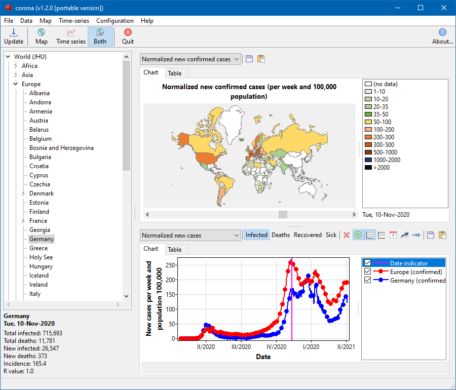

# corona
Downloads daily accumulated case counts of the corona virus disease from the 2019 Novel Coronavirus COVID-19 (2019-nCoV) data repository by Johns Hopkins University CSSE, and from Robert-Koch-Institut, Germany.

- Displays the world-wide infection data in a color-coded map.
- Scroll through previous dates using the scrollbar below the map.
- Plot the data as a function of time: confirmed, death, recovered, sick counts. Cumulative cases, new cases per day.
- Plot the universal curve new cases vs cumulative cases.
- Estimate characteristic pandemic numbers: doubling time, reproduction number. (Disclaimer: due to various calculation methods, these numbers may differ from official data).

## Installation
This repository contains Lazarus source files only. Please use Lazarus v2.0.8 or
later to compile the binary.

No additional packages are required to compile the application. But the OpenSSL library must be available. In Windows, copy the files libeay32.dll and ssleay32.dll of the correct bitness to the application directory.

For Windows the OpenSSL dlls can be downloaded from
- 32 bit: https://packages.lazarus-ide.org/openssl-1.0.2j-i386-win32.zip
- 64 bit: https://packages.lazarus-ide.org/openssl-1.0.2j-x64_86-win64.zip

## Usage
In the normal mode, the program writes cached disease data to subfolder _CoronaData_ of the user's home directory (Windows: _c:\users\<user name>_, Linux: _~/.CoronaData_). The program's configuration data are stored in _c:\users\<user name>\AppData\Local\corona_ in Windows, and in _~/.corona_ in Linux.

There is also a portable mode which is activated by starting the application with the argument _-portable_. In this mode both cached disease data as well as program settings are stored in the application folder. Simply copy this folder if you want to move the application to another computer.

## Data source
- https://github.com/CSSEGISandData/COVID-19
- https://npgeo-corona-npgeo-de.hub.arcgis.com/
